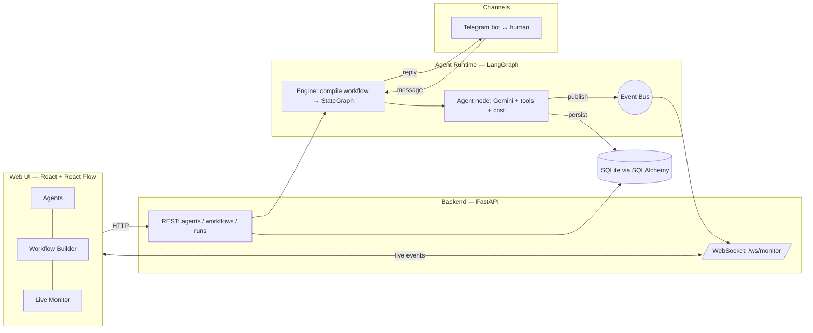

# Agent Orchestration Platform

A platform to **create AI agents, configure how they think and act, wire them into
multi-agent workflows, and run them on a real LangGraph runtime** — with live
monitoring and a Telegram channel so a human can talk to an agent conversationally.

> Built for the Yuno AI Engineer challenge. Runs fully local with a single command.

---

## ✨ What it does

- **Configure agents visually** — name, role, personality (system prompt), model,
  tools, channels, skills, guardrails, interaction rules, temperature, token
  limits and a memory window.
- **Build workflows on a canvas** — drag agents onto a graph, connect them, and
  attach **conditions** to edges. Supports **branching** and **feedback loops**.
- **Real runtime** — every node is a real Gemini call that can execute real tools
  (web search, HTTP fetch, calculator, clock). Agents pass results to each other.
- **Talk to an agent over Telegram** — the support workflow is reachable from a
  Telegram bot; the same conversation streams into the web UI.
- **Live monitoring** — a WebSocket feed of node starts, tool calls, every
  inter-agent message, and running **token + cost** totals.
- **2 prebuilt templates** — *Research & Review* (feedback loop) and
  *Customer Support Triage* (conditional branching, Telegram-connected).

---

## 🏗️ Architecture

Three cleanly separated layers (UI ↔ runtime ↔ persistence), with an event bus
decoupling the runtime from the live-monitoring transport.



**Plain-text view:**

```
React UI ──HTTP──> FastAPI REST ──> LangGraph Engine ──> Agent Nodes (Gemini + tools)
   ^                                      │                     │
   └──────WebSocket──── Event Bus <───────┴── publish ──────────┘
                                          │
Telegram bot ──message──> Engine          └── persist ──> SQLite (SQLAlchemy)
```

### Layer breakdown

| Layer | Where | Responsibility |
|---|---|---|
| **UI** | `frontend/src` | Agent config, visual workflow builder (`@xyflow/react`), live monitor dashboard |
| **API** | `backend/app/api` | REST CRUD + run trigger; `/ws/monitor` WebSocket |
| **Runtime** | `backend/app/runtime` | Compile a workflow to a `StateGraph`, run agent turns, track tokens/cost, emit events |
| **Channels** | `backend/app/channels` | Telegram long-polling integration |
| **Persistence** | `backend/app/models.py` | `Agent`, `Workflow`, `Run`, `Message`, `LogEvent` via SQLAlchemy |

### How a workflow becomes executable

A stored workflow is just **data** — nodes (each bound to an agent) and edges
(each carrying a condition). `runtime/engine.py` compiles it into a LangGraph
`StateGraph`:

- **node** → an async agent turn (`runtime/agent_node.py`): builds the system
  prompt from the agent's config, gives it the shared transcript (windowed by
  `memory_window`), calls Gemini with its tools bound, runs the tool loop, then
  appends its answer to the shared transcript.
- **edge** → a graph edge. Conditional edges implement routing:
  - `always` — unconditional
  - `contains` — follow if the last output contains a keyword (deterministic)
  - `llm` — a tiny router LLM picks among candidate edges
- **feedback loop** → an edge can point *back* to an earlier node (e.g. Editor →
  Writer when the output contains `REVISE`). Runaway loops are bounded by
  `MAX_GRAPH_ITERATIONS` (the graph recursion limit), so cycles always terminate.

---

## 🚀 Run it

### Prerequisites
- A **Google Gemini API key** (free tier works): https://aistudio.google.com/app/apikey
- *(Optional)* A **Telegram bot token** from [@BotFather](https://t.me/BotFather)
- Docker, **or** Python 3.11+ and Node 20+ for local dev.

### 1. Configure
```bash
cp .env.example .env
# edit .env and set GOOGLE_API_KEY (and TELEGRAM_BOT_TOKEN if you want the channel)
```

### 2a. One command (Docker)
```bash
docker compose up --build
```
- Web UI → http://localhost:3000
- API docs → http://localhost:8000/docs

### 2b. Local dev (no Docker)

**Windows (PowerShell)** — two helper scripts are included:
```powershell
./scripts/run-backend.ps1     # creates venv, installs deps, starts API on :8000
./scripts/run-frontend.ps1    # npm install + Vite dev server on :5173
```

**macOS/Linux (or manual):**
```bash
# terminal 1 — backend
cd backend && python -m venv .venv
source .venv/bin/activate
pip install -r requirements.txt
uvicorn app.main:app --reload

# terminal 2 — frontend
cd frontend && npm install && npm run dev   # http://localhost:5173
```

The two template workflows are seeded automatically on first startup.

### Telegram quick start
1. Message [@BotFather](https://t.me/BotFather) → `/newbot` → copy the token.
2. Put it in `.env` as `TELEGRAM_BOT_TOKEN` and restart the backend.
3. Open your bot in Telegram, send `/start`, then ask a support question — it runs
   the **Customer Support Triage** workflow and the conversation appears live in
   the **Live Monitor**.

---

## 🧩 Configurable dimensions per agent

`name`, `role`, `system_prompt` (personality), `model`, `temperature`,
`max_tokens`, `tools`, `channels`, `skills`, `guardrails`, `interaction_rules`,
`memory_enabled`, `memory_window`. Guardrails and interaction rules are injected
into the system prompt on every turn.

---

## 🔌 Extending the platform

**Add a tool** — write a function in `backend/app/runtime/tools.py` and register
it in `TOOL_REGISTRY`. It immediately appears in the agent editor and is bindable
for Gemini function-calling. That's the whole contract.

**Add a workflow template** — add a block to
`backend/app/runtime/templates.py::seed_templates` (create agents, then a
`Workflow` with `nodes`/`edges`/`entry_node`). Seeding is idempotent.

**Add a messaging channel** — create a sibling of
`backend/app/channels/telegram.py` with the same shape: receive text →
`engine.run_workflow(...)` → send the reply. Start/stop it from the app lifespan
in `main.py`.

---

## 🧪 Tests

```bash
cd backend
.venv/Scripts/pytest -q      # Windows  (.venv/bin/pytest on macOS/Linux)
```

Covers the critical paths with a deterministic fake LLM (no key/network needed):

- **Agent creation** — REST CRUD round-trip.
- **Workflow execution** — a sequential run completes and persists messages.
- **Message delivery** — human + agent messages are recorded; cost is tallied.
- **Feedback loop** — Editor REVISE→APPROVED loop runs twice and terminates.
- **Tool safety** — the calculator refuses code execution (`__import__`, etc.).
- **Run guarding** — the run endpoint refuses to execute without an API key.

---

## ⚖️ Technical choices & trade-offs

- **Python** — the agent/LLM ecosystem (LangGraph, langchain-google-genai,
  python-telegram-bot) is first-class here, and it keeps the whole backend in one
  language.
- **LangGraph** — the challenge needs a graph with *conditions and feedback
  loops*. LangGraph's `StateGraph` (nodes, conditional edges, recursion limit)
  maps **1:1** onto the visual builder, which is exactly what the canvas edits.
  CrewAI/AutoGen sit at a higher abstraction that hides the graph we need to
  expose and edit visually.
- **Gemini** — strong, generous free tier → the platform runs end-to-end at zero
  cost during evaluation.
- **SQLite + SQLAlchemy** — zero extra services for "single setup command";
  swapping to Postgres is a one-line `DATABASE_URL` change.
- **Telegram** — long-polling means no public URL/tunnel, so it works fully local.
- **In-process event bus** — simplest correct design for a single node; the clean
  seam to swap for Redis/NATS in a multi-node deployment.

## 🔭 Future improvements

- Redis/NATS-backed event bus + a task queue (Celery/Arq) for horizontal scaling.
- Per-agent scheduling (the `schedule` field is modelled but not yet executed —
  would be driven by APScheduler).
- Auth + multi-tenant workspaces.
- Streaming token-by-token responses to the UI and Telegram.
- Pluggable model providers (OpenAI/Anthropic) behind the existing `build_llm`
  seam.
- Replay / time-travel debugging of a run from the persisted `LogEvent` stream.

---

## 📁 Project layout

```
backend/
  app/
    api/        REST routers + monitoring WebSocket
    runtime/    LangGraph engine, agent node, tools, event bus, templates
    channels/   Telegram integration
    models.py   SQLAlchemy models (persistence)
    main.py     FastAPI app + lifespan (seed templates, start Telegram)
  tests/        critical-path tests (fake LLM)
frontend/
  src/
    pages/      Agents, Workflows (+ builder), Monitor
    components/ WorkflowBuilder (React Flow)
    hooks/      useMonitor (WebSocket)
docker-compose.yml   one-command local stack
scripts/             Windows PowerShell run helpers
```
